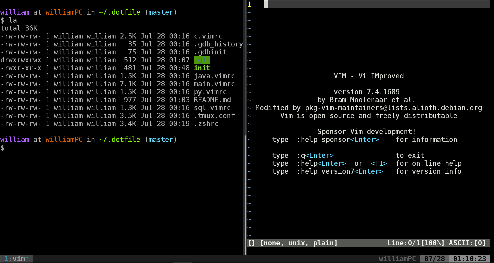

# Dotfiles
> These are my configuration for zsh, tmux, and vim.



## Installation
**Warning:** Before you fork this repository, be sure to review the code in advance. Don't blindly use my setting unless you know what that entails. ***Use at your own risk!***

* If you don't have ```oh-my-zsh``` installed, follow the instruction [here](https://github.com/robbyrussell/oh-my-zsh).
* ```xclip``` the tool I used to copy content from vim buffer to clipboard. Install if needed.

### Using Git and the init script
Make sure to backup your previous settings (```.vimrc```, ```.zshrc```, ```.tmux.conf```), the ```init``` process will overwrite those files.

```
$ cd && git clone "http://github.com/williamhsieh/.dotfile" && ./.dotfile/init
```

## Feedback

Suggestions/improvements [welcome](https://github.com/WilliamHsieh/.dotfile/issues)!

## About me
* [William Hsieh](https://github.com/williamhsieh/)
* [YouTube](https://www.youtube.com/playlist?list=PL9_ICC0aO5tjEbqj4ivBFsafBx8Rw74fg): A series of vim tutorial.

## Acknowledgements
Inspiration and code was taken from many sources, including:
* [Maxin Cardamom](https://github.com/changemewtf/no_plugins)
* [Damian Conway](http://damian.conway.org/About_us/Bio_formal.html) and his [vim configuration](https://github.com/thoughtstream/Damian-Conway-s-Vim-Setup)
* [Nick Nisi](https://nicknisi.com/) and his [presentation](https://github.com/nicknisi/vim-workshop)
* [Hermann Vocke](https://www.hamvocke.com/) and his [dotfiles repository](https://github.com/hamvocke/dotfiles)
* [Mathias Bynens](https://mathiasbynens.be/) and his [dotfiles repository](https://github.com/mathiasbynens/dotfiles/)
* Anyone who  [made a helpful suggestion](https://github.com/WilliamHsieh/.dotfile/issues)
